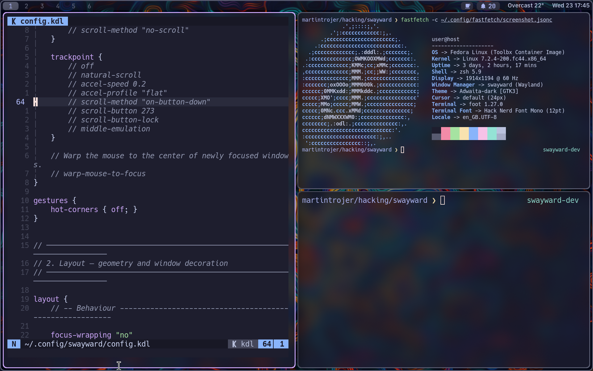

# swayward

**An i3/sway-compatible Wayland compositor, built in Rust on Smithay.**

> sway, gone its own way.

Swayward gives you i3's fully nested container tree on a modern Wayland
compositor: splits inside splits, tabbed and stacked containers, marks,
criteria, the scratchpad, and sway's IPC protocol on `SWAYSOCK` for compatible
clients and scripts. It is a very serious amount of engineering in service of
putting one rectangle beside another rectangle, but correctly.

**Status: beta, and early beta at that.** The compositor runs live sessions,
speaks sway's IPC to real clients, and passes 109 of i3's own test files
unmodified. What it has not had is people: automated testing here is
headless, so nothing yet tells us how it behaves on your hardware, and no
stranger has installed it. Try it if you know i3 or sway and can afford a
compositor that might drop your session.



swayward with a wallpaper, Waybar and three terminals: a `splitv` inside a
`splith`, which is the whole idea in one picture.
[Cult of the Tree](https://github.com/martintrojer/swayward/wiki/Sway-School)
pairs more captures with the tree each one produced.

## Looking for beta testers

**Are you tree-curious, or a seasoned tree surgeon?** Either way, help would
be appreciated.

Particularly useful: running your real sway or i3 config through
[`contrib/sway-to-kdl`](contrib/sway-to-kdl); telling us where it differs from
sway in a way that matters to you, especially differences not already
[explained](https://github.com/martintrojer/swayward/wiki/Differences-from-Sway); breaking the tree with deeply
nested splits and awkwardly timed scratchpad calls; and telling us where the docs
were confusing.

[Open an issue](https://github.com/martintrojer/swayward/issues) with what you
ran, what happened, and what you expected. A vague "this felt wrong" is worth
more than silence.

One thing before you install: this is a compositor, so a crash takes your
whole session. Do not put it on a machine you need today.

## Developed with AI assistance

Not a feature, nor hidden. AI agents are a tool we use to make swayward
better, that's it. If this is a deal-breaker for you, we understand. Thanks
for reading this far.

Don't trust us, check us: swayward is tested against i3's own test suite,
vendored unmodified. [Testing and conformance](https://github.com/martintrojer/swayward/wiki/Testing-and-Conformance)
explains the evidence, and every intentional
difference from sway is [recorded](https://github.com/martintrojer/swayward/wiki/Differences-from-Sway) with a
citation into sway's source. We follow the Linux kernel's rule that
[AI does not sign off](https://www.kernel.org/doc/html/next/process/coding-assistants.html):
a human reviews every change and is responsible for it.

## Why the i3/sway model

This is a good era for Wayland compositors. niri's scrollable strip is a
new idea, and it is built well. swayward is a fork of it and owes it nearly
everything below the layout engine. Hyprland has pushed harder on
effects than anyone. sway did the unglamorous work of being the compositor
people could rely on, and i3 contributed the tree itself.

We still think that tree is the best window-management model there is:

- **It is what you already mean.** Every layout is a nesting of "these share
  space horizontally" and "these share space vertically". Once you see the
  tree, every keystroke follows from it.
- **It composes without limit.** A container holds windows or other
  containers, so tabs inside a split inside a tab cost nothing extra to learn.
  Models built from special cases run out; a tree does not.
- **It is explicit, and it remembers.** swayward does not guess where your
  next window goes. You told it, and the arrangement is a structure you built
  rather than a side effect of the order you opened things in.

[Cult of the Tree](https://github.com/martintrojer/swayward/wiki/Sway-School) teaches the model from first
principles, and [where the tree came from](https://github.com/martintrojer/swayward/wiki/Where-The-Tree-Came-From)
traces it back through wmii to Plan 9.

That explains why the tree. The
[FAQ](https://github.com/martintrojer/swayward/wiki/FAQ#why-does-swayward-exist) handles the awkward follow-up:
why this project exists alongside sway, SwayFX, hy3, and niri; how AI-assisted
development fits into it; and why the test suite is the main reason we think a
new compositor is worth your time.

If the scrollable strip suits you better, use
[niri](https://github.com/YaLTeR/niri). It is excellent, it is where swayward
came from, and swayward deliberately does not offer a scrollable mode.

## Install

**No release exists yet, so nothing below is downloadable today.** That is what
beta1 is for. From then on, each
[release](https://github.com/martintrojer/swayward/releases) carries prebuilt
x86_64 packages:

| File | For |
|---|---|
| `swayward_VERSION_amd64.deb` | Ubuntu 24.04 |
| `swayward-VERSION-fedora43-x86_64.rpm` | Fedora 43 |
| `swayward-VERSION-fedora44-x86_64.rpm` | Fedora 44 |
| `swayward-VERSION-arch-x86_64.pkg.tar.zst` | Arch |
| `swayward-VERSION-ubuntu24.04-x86_64.tar.gz` | prebuilt binaries, with a `.sha256` |

Every package is installed and executed in a clean container before the release
is drafted. The tarball is an Ubuntu 24.04 build needing GLIBC 2.39 and
`libdisplay-info.so.1`, not a generic Linux build. See [Getting
started](https://github.com/martintrojer/swayward/wiki/Getting-Started) for install commands.

There is no COPR repository and no AUR package; both wait until the release
packages have survived real installations.

To install the current source with Nix:

```sh
nix profile install github:martintrojer/swayward
```

The repository flake provides `swayward`, `swayward-debug`, and a development
shell. `nix flake check` runs the full test suite, including the vendored i3
conformance oracle. Without Nix, follow
[Build swayward](docs/BUILDING.md); it needs Rust 1.87 or newer and the usual
wlroots-style build dependencies.

## First run

Pick **Swayward** from your display manager. To try it without leaving your
current session, run it nested in a window:

```sh
swayward
```

The defaults give you a working session: `Mod` is Super, `Mod+Return` opens a
terminal, `Mod+D` runs a launcher, `Mod+Shift+Q` closes a window, and
`Mod+Shift+E` exits. The full set is in
[resources/default-config.kdl](resources/default-config.kdl), and the
[getting-started guide](https://github.com/martintrojer/swayward/wiki/Getting-Started) walks through it.

Press `Mod+Shift+Slash` at any time for the hotkey overlay.

## Using it

Swayward exports `SWAYSOCK` and speaks sway's binary IPC, so the tools you
already have work:

```sh
swaywardmsg -t get_tree
swaywardmsg -t get_workspaces -p
swaywardmsg 'workspace 3'
swaywardmsg -t subscribe -m '["window"]'
```

`swaywardmsg` ships with swayward, so you do not need sway installed to drive
the socket. `swaymsg` works too if you have it.

### Screen sharing and portals

Swayward defaults to `xdg-desktop-portal-gnome`, which gives you the GNOME
window and monitor picker, PipeWire streams and a dynamic cast target. This is
a deliberate difference from sway, which conventionally uses
`xdg-desktop-portal-wlr`. Remote desktop and input injection are not
implemented.

Portals need a full swayward session and a few packages installed; see
[Important software](https://github.com/martintrojer/swayward/wiki/Important-Software).

Waybar 0.15.0 has been smoke-tested unmodified. Mako, swaybg, swayidle and
swaylock use standard Wayland protocols rather than sway IPC. Scripts work to
the extent they stay inside the implemented surface, and the
[sway compatibility guide](https://github.com/martintrojer/swayward/wiki/Sway-Compatibility) explains the
boundary.

### Configuration

Swayward is **IPC-compatible, not config-compatible**. It is configured in
typed KDL, which is what lets it carry niri's animation and rendering settings
without inventing a second config language.

Bring an existing sway config across with the translator, which ships with
swayward:

```sh
swayward-sway-to-kdl ~/.config/sway/config >~/.config/swayward/config.kdl
swayward validate -c ~/.config/swayward/config.kdl
```

It reports what it cannot translate exactly instead of quietly dropping it.
See [Migrate a sway config](docs/SWAY_CONFIG_MIGRATION.md).

## How compatibility is measured

i3 ships 285 Perl test files. swayward vendors 242 of them byte-for-byte from
a pinned i3 revision and runs them against a real headless compositor, real
Wayland clients and the sway IPC socket. The adapter replaces X11 window
setup; it does not edit upstream assertions.

At this revision **109 files pass in full**, unmodified. Across the 3,171
assertions in captured TAP plans, 2,307 pass, 778 are documented sway
divergences, 30 fail and 56 are unreached. The
[testing and conformance guide](https://github.com/martintrojer/swayward/wiki/Testing-and-Conformance) explains
what those results prove.
The green ceiling of 117 files is what this oracle can reach: 109 green, plus
8 vendored files blocked only by implementation or adapter gaps.

This is evidence, not a compatibility percentage. Half the skips, 394 of 778,
are structural: X11-only assertions, i3's own parser binary, i3bar, and tree
nodes sway does not create either.

## What differs from sway

Read [differences from sway](https://github.com/martintrojer/swayward/wiki/Differences-from-Sway) before
migrating. The headlines:

- **X11 identity is flattened.** Xwayland goes through
  `xwayland-satellite`, which presents ordinary `xdg_toplevel` surfaces, so
  separate X11 class, instance, role and XID do not cross the boundary.
- **No `bar {}` block.** Swayward does not launch or configure swaybar.
  Configure Waybar directly.
- **No in-place restart.** Reload is supported; replacing the process while
  keeping clients is not. Sway has no runtime `restart` either.
- **The IPC surface is incomplete.** Some requests, events, criteria and
  command forms are unimplemented and return structured failures rather than
  pretending to succeed.

## Project invariants

- Every `SWAYSOCK` reply is sway-shaped or a structured failure. It never hangs.
- The container tree stays well formed after every mutation.
- A live-session path must not panic, and an `ERROR` in the log is a bug.
- A feature needs executable evidence before it counts as working.
- Stability regressions outrank new features.

## Credits

Swayward is a fork of niri at commit `9e72e491`, and keeps its rendering,
backend, protocol and portal work. See [Fork base](docs/FORK-BASE.md).

- [niri](https://github.com/YaLTeR/niri) by Ivan Molodetskikh — the compositor
  this is built on. The debt is large and gladly acknowledged.
- [Smithay](https://github.com/Smithay/smithay) — the Wayland compositor
  toolkit underneath.
- [sway](https://github.com/swaywm/sway) — the IPC protocol, and the standard
  of reliability worth aiming at.
- [i3](https://i3wm.org) — the tree model, and the conformance suite that keeps
  us honest about it.

Licensed under **GPL-3.0-or-later**. The vendored i3 tests keep their upstream
BSD licence in [`tests/i3/LICENSE`](tests/i3/LICENSE).
