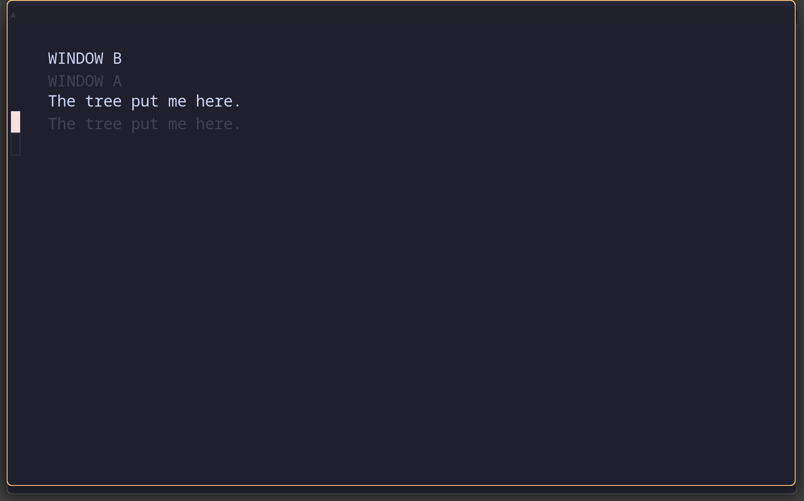
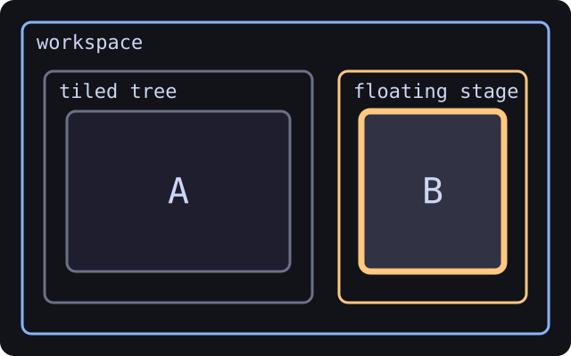
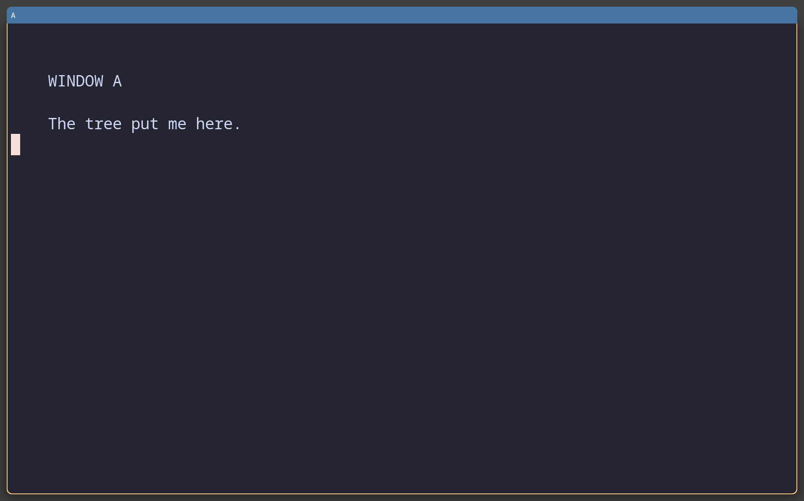
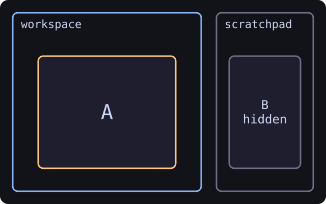
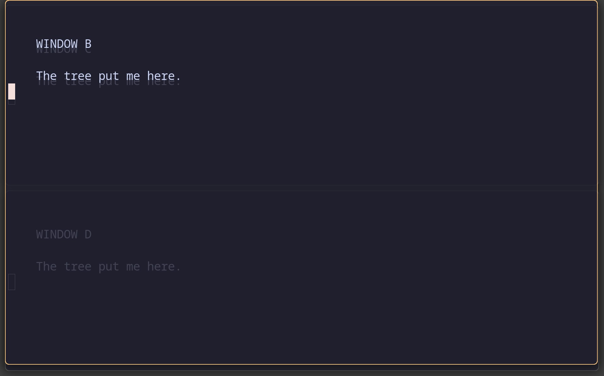
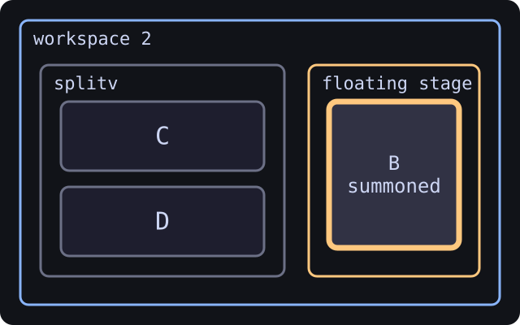

**Induction V: floating, scratchpad, and sticky windows**

The tree has exceptions. Floating windows stand in front of it. Scratchpad
windows leave the workspace and wait in a drawer. Sticky windows follow you
around like a note you attached to every desk. None of this disproves the tree;
it merely confirms that even a cult needs a utility cupboard.

## Floating windows stand in front

> A floating window **lives outside the tree**. It has no parent, no siblings, no layout. It's just a rectangle that sits on top of everything tiled.

That's the whole concept. Everything else is consequences. It took a project
this devoted to parents and siblings a while to accept that some windows simply
do not want a family.

<!-- CAPTURED tree-05-floating-stage
     WHAT: A tiled; B floating and centred above it
     KEYS: open A and B, floating enable B, move B to centre
     WHY: show the two workspace stages without pretending B is a tree child
     SIZE: nested output 1280x800 logical; captured at host scale 1.5
-->

| What the compositor draws | What the tree remembers |
| --- | --- |
|  |  |


### Toggle and verify

- `Mod+Shift+Space` → toggle the focused window between tiled and floating (i3/sway default).

Verify it actually floated by looking for `"type": "floating_con"` in the tree dump:

```
swaywardmsg -t get_tree -p | grep -B 1 '"type":' | grep -E '"(name|type)"'
```

### Mouse: hold Mod and drag

- `Mod` + **left-click drag** anywhere on the window → move it
- `Mod` + **right-click drag** → resize it

Both gestures are built in. They use whichever key `input { mod-key }` names: Super on a TTY, Alt in a nested winit window.

### Two stages per workspace

`Mod+hjkl` only navigates within the layer you're in (tiled or floating). Swayward binds no key to `focus mode_toggle`. To cross between the layers, bind one. This example uses `Mod+Tab`, which is unbound in the shipped config:

```kdl
binds {
    Mod+Tab { command "focus mode_toggle"; }
}
```

`focus tiling` and `focus floating` are available too if you want one key per layer. With `focus-follows-mouse` uncommented in the `input` node, hovering also crosses the layers.

> Each workspace has **two stages**: tiled (back) and floating (front). `focus mode_toggle` is the curtain between them.

### Un-float placement gotcha

When you `Mod+Shift+Space` a floater back to tiled, it's treated as a **brand new window**: inserted via the insertion rule from Induction II as the next sibling of the most recently focused tile. Swayward does *not* remember where the window came from before floating.

To control placement, cross into the tree with your `focus mode_toggle` bind, walk to the desired neighbour, cross back to the floater, then press `Mod+Shift+Space`.

### Keyboard resize

`Mod+R` enters the `resize` mode that the default config defines. Inside that mode, `h`, `j`, `k`, `l` and the arrow keys resize the focused window by 10 px a step, and `Return` or `Escape` returns to the default mode. Directional floating moves count pixels only: sway's parser ignores a trailing `ppt` on `move left 25 ppt` and moves 25 pixels, and swayward follows sway.

### Auto-floating rules

Use a `window-rule` to auto-float specific apps. Find the `app_id` with:

```
swaywardmsg -t get_tree | jq -r '.. | select(.type?=="con" or .type?=="floating_con") | "\(.app_id // .window_properties.class // "?")  ::  \(.name)"' | grep -i <app-name>
```

Then add a rule like:

```
window-rule {
    match app-id=r#"^pavucontrol$"#
    open-floating true
}
```

### The "summon and dismiss" pattern

For utility popups you summon, type into, and dismiss — audio mixers, calculators, password managers — use a richer rule that floats *and* sets a known size and position:

```
window-rule {
    match app-id=r#"^wiremix-float$"#
    open-floating true
    default-column-width { fixed 720; }
    default-window-height { fixed 480; }
}

window-rule {
    match app-id=r#"^org\.gnome\.Calculator$"#
    open-floating true
    default-column-width { fixed 480; }
    default-window-height { fixed 600; }
}
```

Every launch: float, resize to a known size, centre on the active output. The window appears in the same predictable spot every time, with no manual cleanup.

### The window-rule cookbook

| Pattern | Use case |
| --- | --- |
| `open-floating true` | Just float; swayward picks size and position |
| `open-floating true` plus `default-column-width` / `default-window-height` | Summon-and-dismiss popup at a fixed size |
| `open-floating true`, then run the `sticky enable` command | Always-visible overlay, such as PiP |
| `Mod+Shift+Minus` after it opens | Stash into the scratchpad drawer |

**Quick check** — A window is floating. You press `Mod+Shift+Space` to un-float it. Where in the tiled tree does it land?

1. Back exactly where it was before it floated
2. Always at the end of the workspace's top container
3. As the next sibling of the most recently focused tile (insertion rule)
4. Wherever the cursor is hovering

<details><summary>Answer</summary>

**3.** As the next sibling of the most recently focused tile (insertion rule)

Swayward treats it as a brand new window. It doesn't remember pre-float position.

</details>

## The scratchpad is a drawer

> Scratchpad is a hideout for floating utility windows that aren't bound to any workspace. Stash with one key, summon with another.

We needed a place for the windows that refuse the tree, and a drawer was more honest than another layout mode.

### Bindings

| Key | Action |
| --- | --- |
| `Mod+Shift+Minus` | `move scratchpad` — stash focused window (it disappears) |
| `Mod+Minus` | `scratchpad show` — summon/hide; cycles through stash |


<!-- CAPTURED tree-06-scratchpad-hidden
     WHAT: A visible; B stashed and absent from the workspace
     KEYS: from tree-05, move B to scratchpad
     WHY: the disappearance is the drawer closing
     SIZE: nested output 1280x800 logical; captured at host scale 1.5
-->

| What the compositor draws | What the tree remembers |
| --- | --- |
|  |  |


<!-- CAPTURED tree-07-scratchpad-summoned-v3
     WHAT: B summoned onto workspace 2, whose tiled side is a splitv of C and D
     KEYS: from tree-06, workspace 2, open C, split v, open D, scratchpad show
     WHY: show that the drawer has no workspace of its own, on a workspace whose
          shape differs from the one B left
     NOTE: summoning B back onto workspace 1 restores the exact position scene V
          left, so that frame was byte-identical to tree-05 and could not
          distinguish a correct restore from a capture that never ran.
     SIZE: nested output 1280x800 logical; captured at host scale 1.5
-->

| What the compositor draws | What the tree remembers |
| --- | --- |
|  |  |

B is summoned onto workspace 2 here, not back onto the workspace it left,
because the restore is exact: summoned onto workspace 1 it lands on the same
pixels as the floating shot above, and the two frames come out identical. The
size and position survive the drawer; the workspace is whichever one you are on.

### The model: a flat list of floaters with no workspace

- Scratchpad windows are **always floating**. Stashing converts a tiled window to floating.
- They have **no workspace** — they appear on whichever workspace you're on when you summon.
- Each window remembers its **size and position**. Set once, summons always restore.
- You can stash any number of windows. `Mod+Minus` cycles through them; doesn't pop or consume.

Cycling: `hidden → A → hidden → B → hidden → A → …`.

### Eviction

No dedicated "unstash" command. Both routes work because they violate the "floating + no workspace" property:

| Method | Why it evicts |
| --- | --- |
| `Mod+Shift+Space` on a summoned window | Stops floating → must have a workspace → joins current |
| `Mod+Shift+1` through `Mod+Shift+0` | Has a workspace → no longer no-workspace |
| Close the window | Window doesn't exist |

### The useful pattern: stash on launch

For a music player or chat app you always want one keystroke away:

```kdl
window-rule {
    match app-id=r#"^spotify$"#
    sway-for-window-command "move scratchpad"
}
```

Launch the app, then use `Mod+Minus` whenever you need it. The rule moves the
window to the scratchpad as soon as it opens, so it never occupies a tiled
workspace slot.

**Quick check** — You have two terminals stashed in the scratchpad. You press `Mod+Minus` three times. What's on screen at the end?

1. Both terminals visible
2. One terminal visible (the second one in the cycle: show A → hide A → show B)
3. Both terminals removed from scratchpad permanently
4. Nothing visible — the third press hid everything

<details><summary>Answer</summary>

**2.** One terminal visible (the second one in the cycle: show A → hide A → show B)

show A, hide A, show B. The third press is a fresh "summon" and brings up the next one in the cycle.

</details>

## Bonus · Sticky

> A sticky window stays visible on every workspace you switch to. Only applies to floaters.

This is the one arrangement in which a window follows you around, rather than
the reverse. We include it for balance.

The shipped config floats Firefox's Picture-in-Picture player. It does not make it sticky:

```kdl
window-rule {
    match app-id=r#"firefox$"# title="^Picture-in-Picture$"
    open-floating true
}
```

Pop a YouTube video out into PiP and it floats above the tiles on that workspace. To make it follow you across workspaces, focus it and run `swaywardmsg sticky enable`, or bind a key. Swayward implements the `sticky` command and binds no key to it.

### Sticky vs scratchpad

|  | Scratchpad | Sticky |
| --- | --- | --- |
| Visible by default? | No (hidden) | Yes (always) |
| Per-workspace? | No (no workspace) | No (every workspace) |
| Summon needed? | Yes (`Mod+Minus`) | No (just there) |
| Use case | On-demand utility | Always-visible overlay |

**Scratchpad = drawer.** Pull it out when needed. **Sticky = sticker.** Always on the window.

For a manual sticky toggle, add a bind on a free key. This example uses `Mod+Ctrl+S`, which is unbound in the shipped config:

```kdl
binds {
    Mod+Ctrl+S { command "sticky toggle"; }
}
```

---

[← Induction IV: reshape the tree](Tree-School:-Reshape-the-Tree.md) · [Tree command reference →](Tree-Command-Reference.md)
