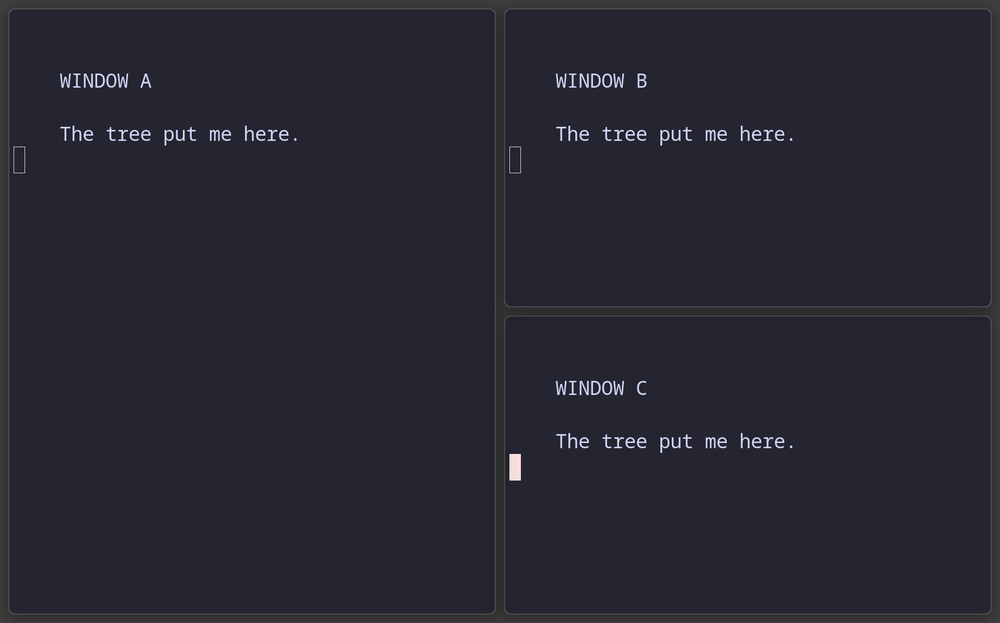
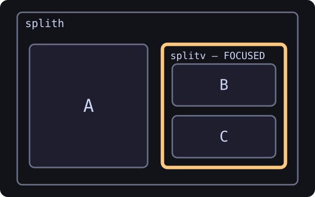

**Induction III: focus the container**

Windows are leaves. Commands get interesting when focus climbs above the leaf
and lands on a branch. This is the tree equivalent of discovering that the
handle on a suitcase moves everything inside it. We are handling this news
normally.

## Focus parent and focus child

We spent two classes staring at leaves. The handle was there the whole time.

Until now, **focus** has always meant "a window is highlighted." But the tree has more than just windows in it — it has containers too. And sometimes you want to operate on **a whole container** instead of one window inside it.

| Key | Action |
| --- | --- |
| `Mod+A` | **Focus parent** (zoom out one level up the tree) |
| `Mod+Ctrl+A` | **Focus child** (zoom back in) |

### What you'll see

Focus a window normally — the border wraps just that window. Press `Mod+A`: the border **expands** to wrap the entire parent container, possibly multiple windows. That's swayward saying "focus is now on the container, not the window."

Press `Mod+A` again and focus expands to the grandparent, then farther up until
it reaches the workspace. The border is not becoming ambitious. It is showing
you the scope of the next command.

Press `Mod+Ctrl+A` to walk back down. Swayward remembers which child you came from. It remembers a surprising amount, for a program whose public image is rectangles.

`Mod+Shift+Q` is not focus child. It runs `kill`, which closes the focused window.

<!-- CAPTURED tree-03-parent-focus
     WHAT: the nested B/C branch focused as one container
     KEYS: build tree-02, then focus parent
     WHY: make container focus visible before asking the reader to act on it
     SIZE: nested output 1280x800 logical; captured at host scale 1.5
-->

| What the compositor draws | What the tree remembers |
| --- | --- |
|  |  |

### Why this matters

This is the moment the tree stops being a diagram we keep showing you and
starts being a thing you can pick up. When focus is on a container,
**commands act on the whole container**:

- **Send a whole column to another workspace**: focus a column container, hit `Mod+Shift+3` — the entire subtree moves.
- **Tab a whole group**: focus a row, hit `Mod+W` — every direct child becomes a tab. `Mod+W` runs `layout tabbed`, which sets the layout rather than toggling it. Use `Mod+E` (`layout toggle split`) to get back to a split.
- **Wrap a whole subtree in a new split**: focus a row, hit `Mod+V` — the entire row becomes the top child of a new splitv.

Floating is the exception. Sway can float a whole container, swayward cannot:
`floating toggle` with a container focused floats nothing. See [Differences
from sway](Differences-from-Sway.md).

**Quick check** — You have a row of 5 windows, all siblings (no nesting). You focus one, press `Mod+A`, then press `Mod+Shift+Space` (toggle floating). What floats?

1. Just the originally focused window
2. Nothing, because swayward floats windows and not containers
3. All five windows, as a group
4. Swayward picks one at random

Answer

**2.** Nothing, because swayward floats windows and not containers

Sway would float the whole subtree. Swayward's floating space holds window tiles rather than tree nodes, so a container target does nothing. This is a recorded deviation, not a setting you can change.

---

[← Induction II: splits become a tree](Tree-School:-Splits-and-Containers.md) · [Induction IV: reshape the tree →](Tree-School:-Reshape-the-Tree.md)
