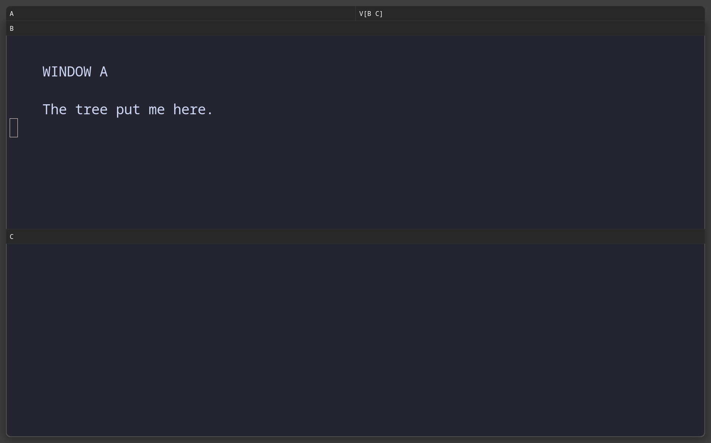
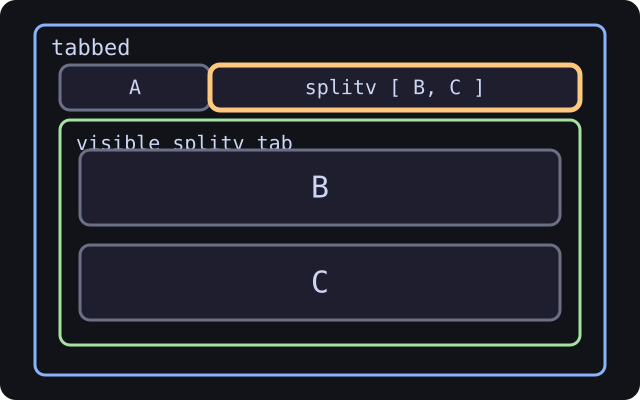
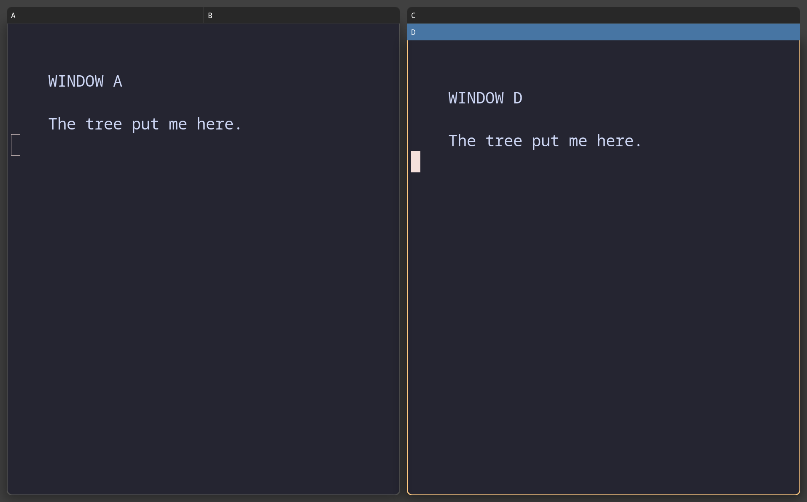
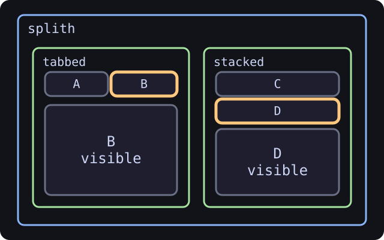

**Induction IV: reshape the tree**

A tree is useful because it can change without forgetting what it is. Here we
retab branches, wrap subtrees, and move windows across boundaries. This is the
class where the innocent rectangle diagram begins to acquire opinions.

## Change what is already there

You can build trees and read trees. Now we edit one without closing every
terminal and pretending that was our plan.

### Changing a container's layout (the easy mutation)

Focus any window. The window's **parent container** is what these commands act on:

- `Mod+W` → set the parent layout to tabbed
- `Mod+S` → set the parent layout to stacking
- `Mod+E` → toggle the parent between splith and splitv, or back to the last split axis from tabbed or stacking
- `Mod+B` / `Mod+V` → split the focused window into a new splith / splitv (see the insertion rule in Induction II)

### Changing the tree shape (the powerful mutation)

Combine `Mod+A` from Induction III with the split keys from Induction II to **wrap whole subtrees**. Recipe to add a status-bar-style window across the bottom of an existing layout:

1. Focus any window in the layout.
2. `Mod+A` until the border wraps the entire workspace content (everything you want above the new bar).
3. `Mod+V` → wraps that whole subtree in a fresh splitv.
4. `Mod+Return` → new terminal appears below the entire layout.

Without the `Mod+A` step, the split key would only wrap one window. `Mod+A` is what makes mutations apply at the *right scope*.

Four keystrokes, one of them repeated, and the whole workspace has a new parent. We wrote the engine and this still feels like getting away with something.

### Tabs that hold containers

<!-- CAPTURED tree-04-tabbed-branch
     WHAT: A and the complete B/C splitv branch as tabs, with the branch visible
     KEYS: build tree-02, focus its parent, layout tabbed
     WHY: show that a tab can contain a whole branch rather than one leaf
     SIZE: nested output 1280x800 logical; captured at host scale 1.5
-->

| What the compositor draws | What the tree remembers |
| --- | --- |
|  |  |

When you tab a row that contains a column, you get tabs where **one of the tabs is the entire column**. Click that tab and the screen fills with the column rendered as a splitv. You can build trees of arbitrary nesting, mixing splits and tabs, for any layout you want. Whether you *should* is a question the tree does not ask and we have stopped asking.

### Tabbed and stacked, side by side

`Mod+W` and `Mod+S` set two different layouts on a container, and nothing stops
one workspace from using both. The two draw the same titlebars in different
arrangements: **tabbed** puts every child's title in one horizontal strip, and
**stacked** gives each child its own full-width title row above the visible one.

<!-- CAPTURED tree-08-tabbed-and-stacked-v1
     WHAT: a tabbed container holding A and B beside a stacked one holding C and D
     KEYS: open A and B, layout tabbed, focus parent, split h, open C, split v,
           open D, layout stacking
     WHY: contrast the two titlebar layouts in one frame
     NOTE: tab strips and stack titles are compositor titlebars, so this scene
           needs normal borders rather than the pixel borders the other scenes
           use to avoid a second titlebar over Foot's own.
     SIZE: nested output 1280x800 logical; captured at host scale 1.5
-->

| What the compositor draws | What the tree remembers |
| --- | --- |
|  |  |

Both sides hold two windows and show one. The tree dump names the difference:
the left container's `layout` is `tabbed` and the right one's is `stacked`.

**Quick check** — You have a row of 3 windows. You focus the middle one and press `Mod+W` (`layout tabbed`). What happens?

1. Only the middle window becomes tabbed (a single-tab group)
2. The whole row collapses into 3 tabs (parent container layout changes from splith to tabbed)
3. The middle window jumps to a new workspace
4. Nothing — you must focus the parent first

Answer

**2.** The whole row collapses into 3 tabs (parent container layout changes from splith to tabbed)

Layout commands act on the focused window's parent container. Same windows in the same order, different rendering.

## Move windows through the tree

You already know `Mod+Shift+hjkl` moves a window. Now we look at what it *actually does*, a phrase that has cost this project several evenings.

> `Mod+Shift+<direction>` walks the focused window through the tree in that direction — swapping with siblings, escaping outward, or entering inward as needed.

It is the inverse of `Mod+<direction>`: `Mod` plus a direction *reads* the tree, `Mod+Shift` plus a direction *rewrites* it.

### The three cases

When you press `Mod+Shift+l` (move right), one of these happens:

#### Case A — swap with a sibling

If there's a sibling immediately to the right in the same parent, they swap places.

#### Case B — escape outward

If there's no sibling that way, but a parent further up has space, the window pops *out* of its container.

#### Case C — enter a sibling container

If the next sibling in that direction is itself a container, the window dives **into** it.

### Bonus case — escape from a perpendicular layout

If you're inside a splitv and press "right," swayward walks *up* the tree until it finds a parent that supports horizontal movement, then drops the window there.

Swayward walks outward until the direction makes sense. A window is therefore
allowed to leave its immediate family, which is more freedom than most nodes
receive in a data-structure tutorial.

**Quick check** — Tree is `splith [ A B* splitv[ C D ] ]` with B focused. You press `Mod+Shift+l` (move right). What happens?

1. B swaps with the column (column moves left, B moves right)
2. B enters the column at the top: `splith [ A splitv[ B C D ] ]`
3. B and C swap inside the column
4. Nothing — B can't move that direction

Answer

**2.** B enters the column at the top: `splith [ A splitv[ B C D ] ]`

B's right neighbour is a container (the splitv), so this is Case C: enter the container.

---

[← Induction III: focus the container](Tree-School:-Focus-the-Container.md) · [Induction V: floating and scratchpad →](Tree-School:-Floating-and-Scratchpad.md)
