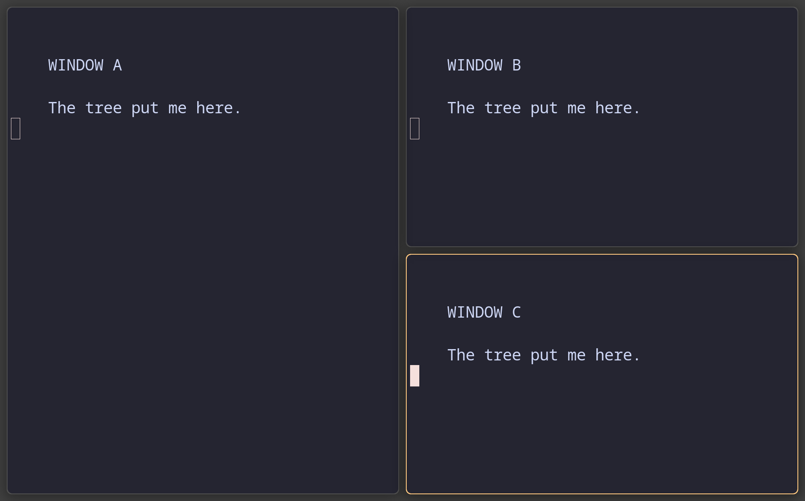
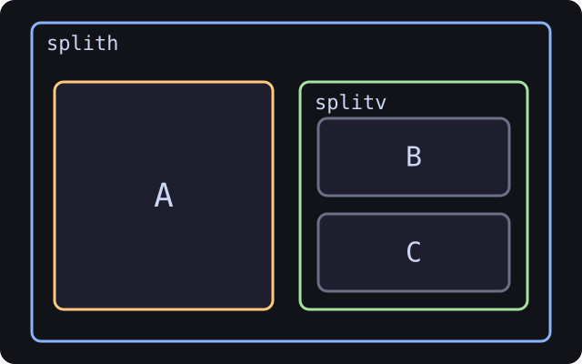

**Induction II: splits become a tree**

Now we perform the dangerous rite of pressing one split key and becoming the
sort of person who points at a screen and says “that is clearly two containers.”
The screenshot shows the pixels. The diagram shows the reason.

## Choose the direction before opening the window

So far swayward has been choosing horizontal because somebody had to make a
decision and the empty workspace declined to comment. Now you take the wheel.

| Key | Effect |
| --- | --- |
| `Mod+B` | Next window opens to the **right** (horizontal) |
| `Mod+V` | Next window opens **below** (vertical) |

These keys do nothing visible by themselves. They just set up the direction for the *next* window you open. Pressing one and watching the screen do nothing is a normal part of the induction, and we have all done it more than once.

Recipe to build a column: focus a window → `Mod+V` → `Mod+Return`. The new terminal appears below.

## The slot remembers

Once you've established a direction in a slot, such as a vertical column, new windows opened *inside that slot* keep going in that direction. You do not press the split key again.

Proof: focus a window inside your vertical column, hit `Mod+Return`, and the new terminal stacks into the column rather than popping out sideways.

> The slot **knows what it is**. Swayward carries the arrangement forward until you change direction again with `Mod+B` or `Mod+V`.

This is the click. We have spent several windows sneaking up on it because
starting with “the compositor stores an ordered recursive node structure” is a
reliable way to make a newcomer remember an urgent appointment elsewhere.

**Quick check** — You built a 3-window column with `Mod+V`. Now you focus the middle window and press `Mod+Return`, with no split key first. What happens?

1. The new terminal opens to the right (horizontal default)
2. The new terminal joins the column, stacked between the focused window and the next one
3. Swayward asks for a direction
4. The new terminal floats

<details><summary>Answer</summary>

**2.** The new terminal joins the column, stacked between the focused window and the next one

The slot remembers it's vertical. New windows in that slot stay vertical until you say otherwise.

</details>

## Meet the container

That "slot that knows what it is" has a name: a **container**. You may now say the word aloud. We have been sitting on it since the first paragraph of Induction I.

> A container = a remembered arrangement, with windows (or other containers) inside it.

Containers can hold:

- **Windows** (the things you actually see), or
- **Other containers** (which themselves hold windows or more containers).

That nesting *is* the tree: remembered arrangements all the way down, until a
real window finally stops the recursion and gives everybody something to look
at.

### See your tree

The diagram is the teaching view. If you want the machine view too, and we
always do, run:

```
swaywardmsg -t get_tree -p | grep -E '"(name|layout)"' | head -40
```

Read the output as nested boxes:

| Field | Means |
| --- | --- |
| `"layout": "splith"` | horizontal container (children side-by-side) |
| `"layout": "splitv"` | vertical container (children stacked) |
| `"layout": "tabbed"` | tabbed container (children stacked as tabs) |
| `"layout": "none"` | a *leaf* — a real window, not a container |
| `"name": "..."` | a window's title (containers have `null` names) |

### Worked example

A workspace with one tile on the left and a vertical column of two tiles on the right looks like this in the dump:

```
"name": "4",                          ← workspace 4
  "layout": "splith",                 ← workspace is horizontal
      "layout": "none",
      "name": "π - dotfiles",         ← a window (left side)
      "layout": "splitv",             ← a vertical container (the column!)
          "layout": "none",
          "name": "Chrome",           ← window in column
          "layout": "none",
          "name": "swaymsg …",        ← window in column
```

As a picture:

<!-- CAPTURED tree-02-nested-split
     WHAT: A on the left; B and C stacked in a right-hand branch
     KEYS: open A and B, split v, open C
     WHY: pair the first genuinely nested screen shape with its exact tree
     SIZE: nested output 1280x800 logical; captured at host scale 1.5
-->

| What the compositor draws | What the tree remembers |
| --- | --- |
|  |  |

**Quick check** — In the worked example above, how many *containers* are there (not counting leaf windows)?

1. 1 (just the column)
2. 2 (the workspace itself, plus the column)
3. 3 (workspace, row, column)
4. 0 — only windows are real

<details><summary>Answer</summary>

**2.** 2 (the workspace itself, plus the column)

Workspace (splith) and the column (splitv) are both containers. The three windows are leaves.

</details>

## Survive the `splith` / `splitv` naming trap

This trips us up too, including while writing the tests. The naming convention:

- `splith` = children laid out **h**orizontally (a side-by-side **row**)
- `splitv` = children laid out **v**ertically (a stacked **column**)

The name describes **how the children are arranged**, NOT the direction of the divider line between them.

### Why it feels backwards

Most people's first instinct is to picture the *divider*:

- "vertical split" → a vertical line down the middle → windows side-by-side
- "horizontal split" → a horizontal line across the middle → windows stacked

That's the CSS / Photoshop / "split a board in half" intuition. It's perfectly reasonable — it's just **the opposite** of sway's. Swayward names from the **result's** point of view: see a row → splith. See a column → splitv.

### Cheat table

| You want… | Key | Container becomes | Tree dump shows |
| --- | --- | --- | --- |
| Next window to the right | `Mod+B` | horizontal row | `"layout": "splith"` |
| Next window below | `Mod+V` | vertical column | `"layout": "splitv"` |

**Quick check** — You see `"layout": "splitv"` in a tree dump. What does that container look like on screen?

1. A horizontal row of windows side-by-side
2. A vertical column of windows stacked top-to-bottom
3. A tabbed group with one visible window
4. A single fullscreen window

<details><summary>Answer</summary>

**2.** A vertical column of windows stacked top-to-bottom

splitv = children arranged vertically = a column. The "v" describes the children's shape, not the divider.

</details>

## The one insertion rule

Everything you've learned so far is consequences of a single rule. A project
that can fill five classes from one rule either has a very good rule or no
sense of proportion. It is both, and we are at peace with it.

> When you open a new window, swayward:
> 1. Looks at the **focused window**
> 2. Finds the **container that window lives in** (its parent)
> 3. Inserts the new window **into that container, right after the focused one**

The new window is always a **sibling** of the focused window — same parent, immediately after.

### The split keys do more than set a direction

`Mod+V` and `Mod+B` run `split v` and `split h`. Those commands do this:

> They wrap the focused window in a **new container** of the requested layout, unless the focused window is the only child of an existing `splith` or `splitv`. In that case they rewrite that parent's layout instead of adding a node.

So if you're focused on A inside `splith [ A B C ]` and hit `Mod+V`, swayward silently rewraps A:

Now opening a new terminal places it inside the new splitv (next sibling of A):

### Repeated presses do not grow a tower

A split key never stacks wrapper on wrapper. After the first press the focused window is an only child of a `splith` or `splitv`, so every later press only rewrites that parent's layout. Hit `Mod+V` ten times in a row and the tree after the tenth press matches the tree after the first. This is why ten anxious split-key presses do not produce a geological record
of our indecision.

What a split key does **not** do is skip the wrap when the layout already matches. Focused on A in `splith [ A B C ]`, `Mod+B` still wraps A in a fresh `splith`, because A has siblings. Sway wraps there too (`sway/sway/tree/container.c:1565-1621`).

### The full table

| Where the focused window sits | You press | What happens |
| --- | --- | --- |
| only child of a splith or splitv | `Mod+B` or `Mod+V` | rewrite that parent's layout, no new node |
| has siblings in a splith | `Mod+V` | wrap the focused window in a new splitv |
| has siblings in a splith | `Mod+B` | wrap the focused window in a new splith |
| has siblings in a splitv | `Mod+B` | wrap the focused window in a new splith |
| has siblings in a splitv | `Mod+V` | wrap the focused window in a new splitv |
| in a tabbed or stacked container | `Mod+B` or `Mod+V` | wrap the focused window in a new splith or splitv |

**Quick check** — You're focused on a window inside a `splitv` column. You press `Mod+V` ten times in a row, then open a new terminal. What happens?

1. The new terminal is wrapped in 10 nested splitv containers
2. The new terminal appears to the right of the column
3. The new terminal appears below the focused window in a splitv, because presses 2 to 10 changed nothing
4. Swayward crashes

<details><summary>Answer</summary>

**3.** The new terminal appears below the focused window in a splitv, because presses 2 to 10 changed nothing

The first `Mod+V` wrapped the focused window in a splitv. From then on that window was an only child, so each later press only rewrote the wrapper's layout.

</details>

**Quick check** — You're focused on window A. The tree is `splith [ A B C ]`. You press `Mod+V`, then open a new terminal called NEW. What does the tree look like?

1. `splith [ A NEW B C ]` — NEW just inserted after A in the row
2. `splitv [ splith[ A B C ] NEW ]` — the whole row got wrapped, NEW went below
3. `splith [ splitv[ A NEW ] B C ]` — A wrapped in a splitv, NEW joined below A
4. `splith [ A B C NEW ]` — NEW went to the end

<details><summary>Answer</summary>

**3.** `splith [ splitv[ A NEW ] B C ]` — A wrapped in a splitv, NEW joined below A

`Mod+V` wrapped A in a fresh splitv (parent was splith, didn't match). NEW then became A's next sibling in that splitv.

</details>

---

[← Induction I: windows and focus](Tree-School:-Windows-and-Focus.md) · [Induction III: focus the container →](Tree-School:-Focus-the-Container.md)
