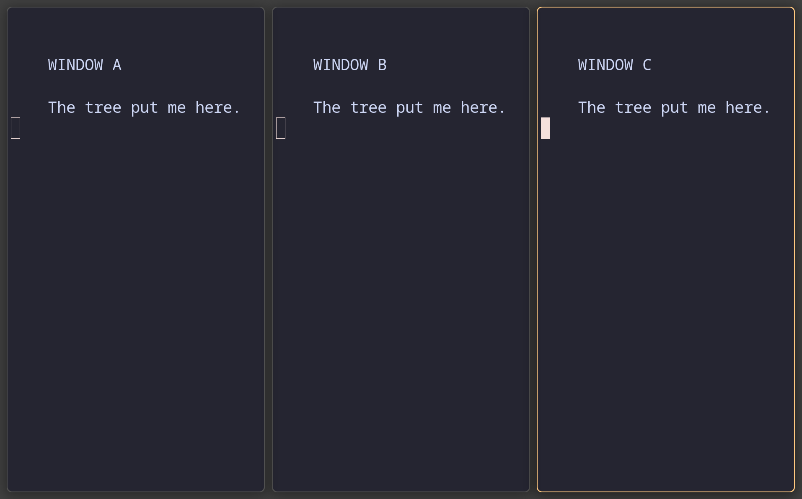
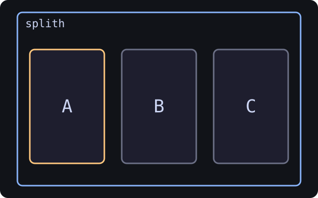

**Induction I: windows and focus**

Welcome to the shallow end. We will open three terminals, move focus, and learn
the one insertion rule that later does most of the heavy lifting. No JSON. No
Latin. Barely any ceremony. The ceremony is rationed, and most of it went on
the name of this tutorial.

## The small pile of keys

| Key | What it does |
| --- | --- |
| `Mod+Return` | Open a terminal |
| `Mod+h/j/k/l` *or* `Mod+←/↓/↑/→` | Move focus left/down/up/right |
| `Mod+Shift+h` etc. *or* `Mod+Shift+arrows` | Move the focused window |
| `Mod+V` / `Mod+B` | Next window goes below / right |
| `Mod+A` | Focus the parent container |
| `Mod+Ctrl+A` | Focus the child container |
| `Mod+Shift+Space` | Toggle floating |
| `Mod+Shift+Q` | Close the focused window |

Every key in this tutorial comes from
[`resources/default-config.kdl`](https://github.com/martintrojer/swayward/blob/main/resources/default-config.kdl). Keys that
swayward ships unbound are labelled *(unbound by default)* where they appear.
The full list is in the [tree command reference](Tree-Command-Reference.md).

## One window claims the kingdom

Open one terminal: `Mod+Return`. It fills the workspace.

> One window takes all the space available to it.

That is the whole lesson, and we will now spend four more classes refusing to leave it alone.

**Quick check** — You open one terminal on an empty workspace. What do you expect?

1. A small window centred on screen
2. A window that fills the workspace
3. Swayward asks where to place it
4. A floating window

Answer

**2.** A window that fills the workspace

A single tiled window expands to fill its workspace. Floating only happens when configured ([Induction V](Tree-School:-Floating-and-Scratchpad.md)) or via auto-rules.

## A second window forces diplomacy

Open another terminal. Swayward picks a direction (default: side-by-side) and **shrinks the existing window** to make room. The first window is not consulted. The rule is i3's; we are its most enthusiastic transcribers.

> Swayward never overlaps tiled windows. Space is always divided, never stacked.

Tiled windows have no z-order. Overlap was not on offer. People who like floating windows will miss that, and Induction V gives it back.

**Quick check** — With two terminals open side-by-side, you open a third. What happens?

1. Third window opens floating on top
2. Swayward refuses — "too many windows"
3. All three windows shrink to ~1/3 each, in a row
4. The third replaces one of the existing two

Answer

**3.** All three windows shrink to ~1/3 each, in a row

Tiles divide space. The arrangement (here: a row) is preserved; new windows just take their share.

<!-- CAPTURED tree-01-three-window-row
     WHAT: three labelled terminals A, B, C in the shipped horizontal layout
     KEYS: open A, B, C with the default Mod+Return insertion behaviour
     WHY: show that the visible row and the remembered splith are the same fact
     SIZE: nested output 1280x800 logical; captured at host scale 1.5
-->

| What the compositor draws | What the tree remembers |
| --- | --- |
|  |  |

## The arrangement has a memory

Swayward didn't *happen* to put your three windows in a row. It **decided** "these go horizontally" and **remembers** that decision. Open a fourth terminal — it joins the row, four side-by-side.

> Swayward is keeping a note: "these windows are arranged horizontally." That note will eventually have a name: *container* ([Induction II](Tree-School:-Splits-and-Containers.md)).

For now, just hold the idea: arrangements are remembered, not coincidental.

## Focus chooses who gets the next command

One window has a coloured border (orange with the shipped config). That's the **focused** window — the one keystrokes go to.

Move focus with either of these — they're bound identically:

- `Mod+h` / `j` / `k` / `l` (vim-style: left/down/up/right)
- `Mod+←` / `↓` / `↑` / `→` (arrow keys, exactly the same)

Swayward defaults to `focus-wrapping "yes"`, which is also sway's default, so focus **wraps at the edge**. Press `Mod+h` (or `Mod+←`) on the leftmost window of a row and focus lands on the rightmost one. To stop focus at the edge instead, set `focus-wrapping "no"` in the `layout` node.

**Quick check** — Which statement about focus is true with the shipped config?

1. Multiple windows can be focused if you hold `Shift`
2. Focus is determined by mouse position only
3. Exactly one window is always focused; focus moves with `Mod+hjkl` (or arrows) and wraps at edges
4. Focus never leaves the window you opened first

Answer

**3.** Exactly one window is always focused; focus moves with `Mod+hjkl` (or arrows) and wraps at edges

Single focus, keyboard-driven, wrapping. The mouse does *not* change focus with the shipped config: `focus-follows-mouse` is commented out in `resources/default-config.kdl`. Uncomment it in the `input` node to get sway's pointer-focus behaviour.

## New windows follow focus

The single most important rule:

> A new window opens **next to whichever window is currently focused**, in whatever arrangement that window lives in.

Proof: with three terminals A, B, C in a row, focus the leftmost (A) and open a new terminal. The new window appears **between A and B**, not at the end of the row. Focus is the anchor. Most of what the later classes do that looks clever is this rule, applied with a straight face.

**Quick check** — Three terminals in a row, side-by-side. You focus the middle one and open a fourth terminal. Where does it appear?

1. To the far right of the row
2. Below the middle terminal (stacked)
3. Between the middle and right terminals
4. It replaces the middle terminal

Answer

**3.** Between the middle and right terminals

Next to the focused window, in the same arrangement (the row).

---

[← Cult of the Tree](Sway-School.md) · [Induction II: splits become a tree →](Tree-School:-Splits-and-Containers.md)
